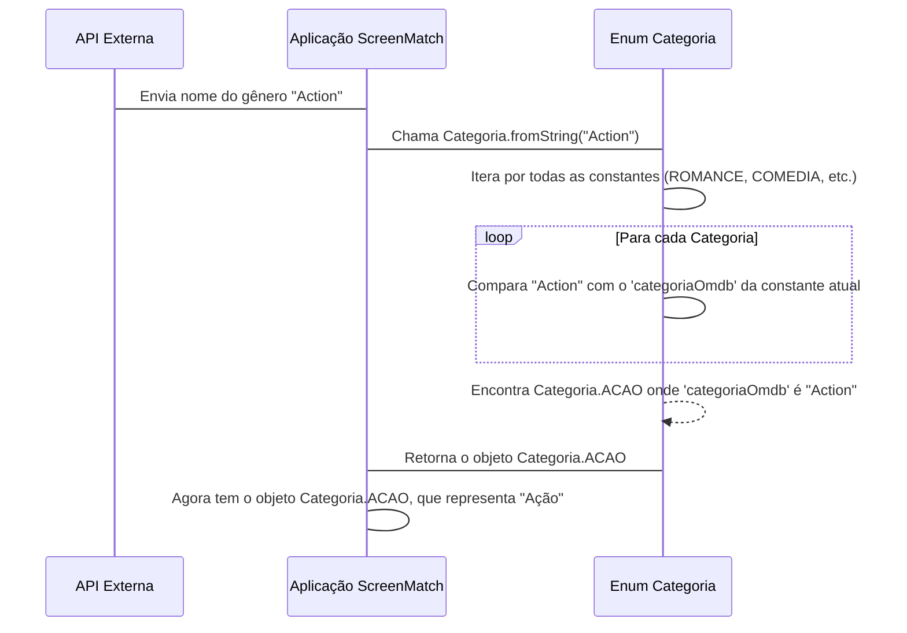

# Chapter 1: Categorias de Séries


Bem-vindo ao primeiro capítulo do nosso tutorial sobre o projeto `ScreenMatch`! Aqui, começaremos a desvendar como o aplicativo gerencia informações sobre séries, e o ponto de partida é algo fundamental: como organizamos as séries por tipo ou gênero.

Imagine que você está criando um aplicativo de catálogo de séries, como a Netflix ou o Prime Video. Uma das primeiras coisas que você precisa é poder pesquisar e organizar as séries por gênero, certo? Você esperaria ver categorias como "Comédia", "Drama" ou "Ação", e não "Comedy", "Drama" ou "Action". Além disso, é importante que seu aplicativo saiba *exatamente* quais gêneros existem para evitar erros de digitação ou categorias que não fazem sentido.

É exatamente isso que o conceito de "Categorias de Séries" nos ajuda a resolver no `ScreenMatch`! Ele nos permite ter um "catálogo" pré-definido e padronizado de todos os gêneros possíveis para as séries.

## O Problema: Gêneros Variados e em Outro Idioma

Nossa aplicação `ScreenMatch` buscará informações de séries de uma API externa (como o OMDB, que veremos em capítulos futuros). Essa API nos fornece os gêneros em inglês, por exemplo: "Comedy", "Action", "Romance".

O desafio é duplo:
1.  **Padronização:** Como garantimos que "Action" e "Ação" são a mesma coisa para o nosso sistema, e que não teremos "Ação", "ação" ou "ação!" como categorias diferentes?
2.  **Localização:** Como exibimos esses gêneros em português para o usuário, mesmo que venham em inglês da API?

## A Solução: `enum` `Categoria`

Para resolver isso, utilizamos um tipo especial no Java chamado `enum` (de "enumeração"). Pense em um `enum` como uma lista fechada e fixa de opções. Por exemplo, os dias da semana (`DOMINGO`, `SEGUNDA`, `TERCA`) ou os meses do ano (`JANEIRO`, `FEVEREIRO`, etc.). Você só pode escolher uma dessas opções pré-definidas.

No `ScreenMatch`, criamos um `enum` chamado `Categoria`. Ele define quais são os gêneros aceitos e, para cada um, guarda tanto o nome que vem da API (em inglês) quanto o nome que queremos exibir para o usuário (em português).

Vamos dar uma olhada na estrutura do `enum Categoria`:

```java
// src/main/java/br/com/alura/ScreenMatch/entities/Categoria.java
public enum Categoria {
    ROMANCE("Romance", "Romance"),
    COMEDIA("Comedy", "Comédia"),
    DRAMA("Drama", "Drama"),
    CRIME("Crime", "Crime"),
    ACAO("Action", "Ação");

    // ... (campos e métodos internos)
}
```
**O que vemos aqui?**
*   `public enum Categoria { ... }`: Declaração do nosso `enum` chamado `Categoria`.
*   `ROMANCE("Romance", "Romance"), COMEDIA("Comedy", "Comédia"), ...`: Estas são as "opções" fixas, ou **constantes**, do nosso `enum`. Cada constante representa um gênero.
*   `("Comedy", "Comédia")`: Para cada constante (como `COMEDIA`), passamos dois valores. O primeiro (`"Comedy"`) é o nome do gênero como ele vem da API (em inglês, `categoriaOmdb`). O segundo (`"Comédia"`) é o nome que queremos usar no nosso aplicativo (em português, `categoriaPortugues`).

## Como a `Categoria` Funciona por Dentro

Cada uma dessas constantes do `enum` (`ROMANCE`, `COMEDIA`, etc.) é como um pequeno objeto que carrega consigo as duas informações: o nome em inglês e o nome em português.

Vamos ver como isso é feito no código:

```java
// src/main/java/br/com/alura/ScreenMatch/entities/Categoria.java
package br.com.alura.ScreenMatch.entities;

public enum Categoria {
    ROMANCE("Romance", "Romance"),
    COMEDIA("Comedy", "Comédia"),
    DRAMA("Drama", "Drama"),
    CRIME("Crime", "Crime"),
    ACAO("Action", "Ação");

    private String categoriaOmdb;       // Guarda o nome do gênero como vem da API (em inglês)
    private String categoriaPortugues;  // Guarda o nome do gênero em português

    // Construtor: usado para inicializar cada constante do enum
    Categoria(String categoriaOmdb, String categoriaPortugues) {
        this.categoriaOmdb = categoriaOmdb;
        this.categoriaPortugues = categoriaPortugues;
    }

    // ... (métodos para conversão)
}
```
*   `private String categoriaOmdb;`: Um campo que armazena o nome do gênero vindo da API externa.
*   `private String categoriaPortugues;`: Um campo que armazena o nome do gênero em português, para uso na aplicação.
*   `Categoria(String categoriaOmdb, String categoriaPortugues) { ... }`: Este é o **construtor** do `enum`. Ele é chamado automaticamente quando você define cada constante (como `COMEDIA("Comedy", "Comédia")`), pegando os dois textos e guardando-os nos campos `categoriaOmdb` e `categoriaPortugues`.

## Convertendo Nomes de Gêneros

Agora, a parte mais interessante: como usamos isso para converter "Action" para "Ação"? O `enum Categoria` possui métodos especiais para isso: `fromString()` e `fromPortugues()`.

### `fromString(String text)`: Do nome da API para o objeto `Categoria`

Este método é crucial. Imagine que a API nos envia a string `"Action"`. Nós precisamos transformar essa string em algo que nosso aplicativo entenda como a categoria "Ação". O método `fromString()` faz exatamente isso: ele recebe uma string (geralmente da API) e tenta encontrar a constante `Categoria` correspondente.

Veja como ele funciona passo a passo:



E aqui está o código desse método:

```java
// src/main/java/br/com/alura/ScreenMatch/entities/Categoria.java
// ...
public enum Categoria {
    // ... constantes e construtor

    // Percorre as categorias do ENUM para encontrar uma correspondência
    // Usado para converter o nome da API (inglês) para a nossa Categoria
    public static Categoria fromString(String text) {
        // Categoria.values() retorna um array com todas as constantes do enum (ROMANCE, COMEDIA, etc.)
        for (Categoria categoria : Categoria.values()) {
            // Compara o texto recebido (ignorando maiúsculas/minúsculas)
            // com o nome da categoria vindo da API (categoriaOmdb)
            if (categoria.categoriaOmdb.equalsIgnoreCase(text)) {
                return categoria; // Se encontrar, retorna a constante Categoria correspondente
            }
        }
        // Se nenhuma categoria for encontrada depois de percorrer todas, lança um erro
        throw new IllegalArgumentException("Nenhuma categoria encontrada: " + text);
    }

    // ... (fromPortugues)
}
```

**Como usar?**

Suponha que recebemos o gênero "Action" da API.

```java
// Suponha que a API retorne a string "Action"
String generoDaApi = "Action";

// Usamos o método fromString para obter a constante Categoria correspondente
Categoria categoriaObtida = Categoria.fromString(generoDaApi);

// O objeto 'categoriaObtida' agora é a constante Categoria.ACAO.
// Ela carrega internamente os nomes "Action" e "Ação".
// Em capítulos futuros, você verá como usar esse objeto para exibir
// "Ação" ao usuário ou para filtrar séries.
System.out.println("O objeto Categoria encontrado é: " + categoriaObtida.name());
// Saída esperada: O objeto Categoria encontrado é: ACAO
```
O método `name()` acima é um método padrão de todo `enum` em Java, que retorna o nome da constante (ex: `ACAO`). Ele nos mostra que encontramos o objeto certo!

### `fromPortugues(String text)`: Do nome em português para o objeto `Categoria`

Similarmente, este método faz o caminho inverso. Se o usuário digitar "Comédia" para buscar séries, podemos usar `fromPortugues()` para encontrar a constante `COMEDIA` correspondente.

```java
// src/main/java/br/com/alura/ScreenMatch/entities/Categoria.java
// ...
public enum Categoria {
    // ... constantes e construtor

    // ... (fromString)

    // Percorre as categorias do ENUM para encontrar uma correspondência
    // Usado para converter o nome em português (digitado pelo usuário, por exemplo)
    // para a nossa Categoria
    public static Categoria fromPortugues(String text) {
        for (Categoria categoria : Categoria.values()) {
            // Compara o texto recebido com o nome da categoria em português
            if (categoria.categoriaPortugues.equalsIgnoreCase(text)) {
                return categoria; // Retorna a constante Categoria correspondente
            }
        }
        throw new IllegalArgumentException("Nenhuma categoria encontrada: " + text);
    }
}
```

**Como usar?**

Se o usuário digitar "Comédia":

```java
// Suponha que o usuário digitou "Comédia"
String generoDoUsuario = "Comédia";

// Usamos o método fromPortugues para obter a constante Categoria correspondente
Categoria categoriaObtidaPeloUsuario = Categoria.fromPortugues(generoDoUsuario);

System.out.println("O objeto Categoria encontrado é: " + categoriaObtidaPeloUsuario.name());
// Saída esperada: O objeto Categoria encontrado é: COMEDIA
```

### O que acontece se não encontrar?

Ambos os métodos, `fromString` e `fromPortugues`, lançam uma `IllegalArgumentException` (uma exceção, ou seja, um tipo de erro) se não conseguirem encontrar uma categoria correspondente. Isso é importante para que a aplicação saiba que um nome de gênero inválido foi fornecido e possa lidar com isso (por exemplo, avisando o usuário).

## Conclusão

Neste primeiro capítulo, exploramos o `enum Categoria` no `ScreenMatch`. Vimos como ele nos ajuda a:
*   **Padronizar** os gêneros de séries, usando uma lista fixa de opções.
*   **Localizar** os nomes dos gêneros, convertendo do inglês (da API) para o português (para o usuário).
*   **Aumentar a robustez** da aplicação, garantindo que apenas gêneros válidos sejam utilizados.

Essa base sólida para as categorias será essencial nos próximos passos. No próximo capítulo, vamos mergulhar nos **[Modelos de Dados Principais](02_modelos_de_dados_principais_.md)**, onde você verá como essa `Categoria` é integrada às classes que representam as séries e os episódios.

Pronto para o próximo passo? Clique aqui: [Modelos de Dados Principais](02_modelos_de_dados_principais_.md)

---

Generated by [AI Codebase Knowledge Builder](https://github.com/The-Pocket/Tutorial-Codebase-Knowledge)