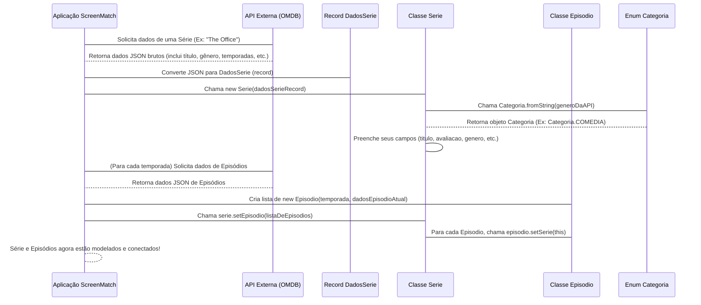

# Chapter 2: Modelos de Dados Principais


Bem-vindo ao segundo capítulo do nosso tutorial sobre o `ScreenMatch`! No [Capítulo 1: Categorias de Séries](01_categorias_de_séries_.md), aprendemos como organizar e padronizar os gêneros das séries usando o `enum Categoria`. Isso nos deu uma base sólida para classificar o conteúdo.

Mas e agora? Onde guardamos todas as outras informações de uma série, como o título, o número de temporadas, a sinopse e, claro, os detalhes de cada episódio? É exatamente isso que os "Modelos de Dados Principais" nos ajudam a resolver!

Imagine que você está organizando sua coleção de filmes e séries em casa. Para cada série, você precisaria de um cartão ou um "formulário" para anotar todas as informações importantes: o nome da série, quantas temporadas tem, quem são os atores principais, e uma breve descrição. Além disso, para *cada episódio* dentro dessa série, você precisaria de outro formulário menor, anotando o nome do episódio, a qual temporada ele pertence e sua avaliação.

No `ScreenMatch`, esses "formulários" são representados por classes Java: a classe `Serie` e a classe `Episodio`. Elas são os "blocos de construção" fundamentais que definem como as informações das séries e de seus capítulos são estruturadas e armazenadas no nosso sistema.

---

## `Serie`: O Molde para Uma Série Completa

A classe `Serie` é como o formulário principal para cada série que queremos catalogar. Ela armazena todas as informações de alto nível de uma série, como seu nome, quantas temporadas existem, sua avaliação geral, e até mesmo sua [Categoria](01_categorias_de_séries_.md).

Pense em "The Office" (a série):
*   **Título**: The Office
*   **Total de Temporadas**: 9
*   **Avaliação**: 8.9
*   **Gênero**: Comédia (lembra do nosso `enum Categoria`?)
*   **Sinopse**: Uma empresa de papel, um chefe peculiar...

Essas são as informações que a nossa classe `Serie` guarda. Veja uma versão simplificada de como ela é definida:

```java
// src/main/java/br/com/alura/ScreenMatch/entities/Serie.java
package br.com.alura.ScreenMatch.entities;

import java.util.List; // Importar List para a lista de episódios

public class Serie {
   private Long id; // Identificador único da série
   private String titulo;
   private Integer totalTemporadas;
   private Double avaliacao;
   private Categoria genero; // Nosso enum do Capítulo 1!
   private String poster;
   private String sinopse;
   private String atores;

   // Uma série tem muitos episódios (veremos mais sobre isso)
   private List<Episodio> episodios;

   // ... construtor, getters e setters (métodos para acessar/modificar os dados)
}
```

**O que estamos vendo aqui?**
*   `private String titulo;`: Guarda o nome da série.
*   `private Integer totalTemporadas;`: O número total de temporadas.
*   `private Categoria genero;`: Aqui usamos o nosso `enum Categoria` do capítulo anterior! Isso garante que o gênero seja sempre um dos tipos válidos que definimos (COMEDIA, DRAMA, etc.).
*   `private List<Episodio> episodios;`: Esta linha é muito importante! Ela indica que uma `Serie` pode ter uma *lista* de objetos `Episodio`. Veremos mais sobre isso na seção de relacionamentos.

---

## `Episodio`: O Molde para Cada Capítulo

A classe `Episodio` é o formulário detalhado para *cada episódio individual* dentro de uma série. Cada episódio tem seus próprios dados, como o número da temporada a que pertence, seu título específico, e até mesmo sua própria avaliação.

Pegando um episódio de "The Office", por exemplo, "Dinner Party":
*   **Temporada**: 4
*   **Número do Episódio**: 13
*   **Título**: Dinner Party
*   **Avaliação**: 9.5
*   **Data de Lançamento**: 2008-04-10

Aqui está uma versão simplificada da classe `Episodio`:

```java
// src/main/java/br/com/alura/ScreenMatch/entities/Episodio.java
package br.com.alura.ScreenMatch.entities;

import java.time.LocalDate; // Para a data de lançamento

public class Episodio {
    private Long id; // Identificador único do episódio
    private Integer temporada;
    private String titulo;
    private Integer numeroEpisodio;
    private Double avaliacao;
    private LocalDate dataLancamento;

    // Um episódio pertence a uma série (veremos mais sobre isso)
    private Serie serie;

    // ... construtor, getters e setters
}
```

**O que estamos vendo aqui?**
*   `private Integer temporada;`: O número da temporada a que este episódio pertence.
*   `private String titulo;`: O título específico deste episódio.
*   `private Double avaliacao;`: A avaliação deste episódio em particular.
*   `private Serie serie;`: Esta linha indica que cada `Episodio` está associado a uma `Serie` específica. É assim que sabemos a qual série um episódio pertence.

---

## A Conexão entre Série e Episódios: Relacionamentos

Agora, como as classes `Serie` e `Episodio` se conectam? Uma série é composta por *muitos* episódios, mas um episódio pertence a *apenas uma* série. Isso é o que chamamos de relacionamento "um para muitos" (One-to-Many).

*   Na classe `Serie`, temos uma `List<Episodio> episodios;` que guarda todos os episódios daquela série.
*   Na classe `Episodio`, temos um `Serie serie;` que aponta para a série à qual aquele episódio pertence.

O Java e o framework de persistência (que veremos em capítulos futuros) nos ajudam a gerenciar essa ligação automaticamente usando anotações como `@OneToMany` (na `Serie`) e `@ManyToOne` (no `Episodio`).

Uma parte importante dessa conexão acontece quando adicionamos episódios a uma série. O método `setEpisodio` na classe `Serie` garante que cada episódio "saiba" a qual série ele pertence:

```java
// src/main/java/br/com/alura/ScreenMatch/entities/Serie.java
// ... dentro da classe Serie

// Realizando associação da série com o Episódio
public void setEpisodio(List<Episodio> episodio) {
   // Para cada episódio na lista que recebemos...
   episodio.forEach(e -> e.setSerie(this)); // Dizemos ao episódio que 'esta' série é a sua série.
   this.episodios = episodio; // Então, atribuímos a lista à nossa propriedade 'episodios'.
}
```

**Por que isso é importante?**
Quando você cria uma lista de objetos `Episodio` e os passa para uma `Serie` usando `setEpisodio`, cada `Episodio` individualmente recebe uma referência à `Serie` pai. Isso mantém a conexão bidirecional: a série sabe quais são seus episódios, e cada episódio sabe a qual série ele pertence.

---

## Como Usamos Esses Modelos? Criando Nossas Séries e Episódios

No dia a dia do `ScreenMatch`, nós recebemos dados de uma API externa (como o OMDB, que veremos mais adiante). Esses dados vêm em um formato que precisamos "traduzir" para os nossos objetos `Serie` e `Episodio`.

### Criando um Objeto `Serie`

Quando recebemos os dados de uma série da API (representados por um objeto `DadosSerie`), usamos esses dados para construir um novo objeto `Serie`.

```java
// src/main/java/br/com/alura/ScreenMatch/entities/Serie.java
// ... dentro da classe Serie

// Construtor que recebe os dados da API
public Serie(DadosSerie dadosSerie) {
   this.titulo = dadosSerie.titulo();
   this.totalTemporadas = dadosSerie.totalTemporadas();
   // Converte a avaliação, se houver
   this.avaliacao = OptionalDouble.of(Double.valueOf(dadosSerie.avaliacao())).orElse(0.0);
   // Converte o gênero da string da API para nosso enum Categoria!
   // Usa o fromString do Capítulo 1 para isso
   this.genero = Categoria.fromString(dadosSerie.genero().split(",")[0].trim());
   this.atores = dadosSerie.atores();
   this.poster = dadosSerie.poster();
   // Traduz a sinopse usando o ConsultaChatGPT (serviço externo)
   this.sinopse = ConsultaChatGPT.obterTraducao(dadosSerie.sinopse().trim());
}
```

**Como funciona?**
Quando a aplicação baixa os dados de uma série, ela os empacota em um objeto `DadosSerie`. Nosso construtor da classe `Serie` então pega esses `dadosSerie` e usa cada pedaço de informação (título, temporadas, etc.) para preencher as propriedades do *novo objeto `Serie`* que está sendo criado.

Observe a linha `this.genero = Categoria.fromString(...)`. É aqui que nosso conhecimento do [Capítulo 1: Categorias de Séries](01_categorias_de_séries_.md) se torna crucial! Ela converte a string do gênero vinda da API (ex: "Comedy") para o nosso objeto `Categoria.COMEDIA`.

### Criando um Objeto `Episodio`

Da mesma forma, quando recebemos os dados de um episódio (que geralmente vêm dentro dos dados da série ou de uma consulta separada), criamos objetos `Episodio`.

```java
// src/main/java/br/com/alura/ScreenMatch/entities/Episodio.java
// ... dentro da classe Episodio

// Construtor que recebe o número da temporada e os dados do episódio
public Episodio(Integer numeroTemporada, DadosSerie dadosEpisodios){ // 'dadosEpisodios' aqui é um record com info do episódio
    this.temporada = numeroTemporada;
    this.titulo = dadosEpisodios.titulo();
    this.numeroEpisodio = dadosEpisodios.episodio();

    try{ // Tenta converter a avaliação para Double
        this.avaliacao = Double.valueOf(dadosEpisodios.avaliacao());
    }catch (NumberFormatException e){ // Se não conseguir (ex: avaliação "N/A"), usa 0.0
        this.avaliacao = 0.0;
    }
    try{ // Tenta converter a data de lançamento
        this.dataLancamento = LocalDate.parse(dadosEpisodios.lancamento());
        } catch (DateTimeParseException e){ // Se der erro, data é nula
            this.dataLancamento = null;
    }
}
```

**Entendendo o processo:**
Este construtor de `Episodio` pega o número da temporada (que pode vir de um loop externo que processa as temporadas) e um `DadosSerie` (que, neste contexto, está sendo usado para carregar os detalhes de um *único episódio*). Ele então preenche os campos do novo objeto `Episodio`, lidando com possíveis erros de conversão para avaliação e data.

---

## Fluxo de Criação de Dados (Por Dentro)

Vamos visualizar como esses modelos se encaixam quando a aplicação está coletando informações sobre uma série:



**Explicando o fluxo:**

1.  A `Aplicação ScreenMatch` (o `App`) pede os dados de uma série para uma `API Externa`.
2.  A `API` responde com os dados da série (e seus episódios) em um formato que é primeiro interpretado como um `DadosSerieRecord`.
3.  O `App` usa esse `DadosSerieRecord` para criar um novo objeto da `Classe Serie`.
4.  Dentro do construtor da `Classe Serie`, o gênero (que vem como texto da API) é passado para o método `fromString` do `Enum Categoria` (que vimos no Capítulo 1). O `Enum Categoria` retorna o objeto `Categoria` correto (ex: `Categoria.COMEDIA`).
5.  A `Classe Serie` então preenche todas as suas informações internas.
6.  Em seguida, a `Aplicação` processa os dados dos *episódios*. Para cada um, um novo objeto da `Classe Episodio` é criado, preenchendo seus próprios detalhes.
7.  Finalmente, a `Aplicação` chama o método `setEpisodio` na `Classe Serie`, passando a lista de `Episodio`s criados. Esse método garante que cada `Episodio` dentro da lista receba uma referência à sua `Serie` pai, estabelecendo a conexão bidirecional.

---

## Conclusão

Neste capítulo, exploramos os "Modelos de Dados Principais" do `ScreenMatch`: as classes `Serie` e `Episodio`. Vimos como elas funcionam como "formulários" para organizar todas as informações de séries e de seus respectivos capítulos.

Aprendemos que:
*   A classe `Serie` guarda os dados gerais de uma série e uma lista de seus `Episodio`s.
*   A classe `Episodio` guarda os dados de um capítulo específico e aponta para a `Serie` à qual pertence.
*   Ambas trabalham juntas, com um relacionamento de "um para muitos", para representar a estrutura hierárquica das séries e seus episódios.
*   A `Categoria` do [Capítulo 1](01_categorias_de_séries_.md) é integrada diretamente à classe `Serie` para garantir a padronização dos gêneros.

Com esses modelos de dados em mãos, o próximo passo é entender como tudo isso se junta no "coração" da nossa aplicação. No próximo capítulo, vamos mergulhar no **[Ponto de Entrada da Aplicação](03_ponto_de_entrada_da_aplicação_.md)**, onde você verá como instanciamos e manipulamos esses objetos para dar vida ao nosso `ScreenMatch`.

Pronto para o próximo passo? Clique aqui: [Ponto de Entrada da Aplicação](03_ponto_de_entrada_da_aplicação_.md)

---

Generated by [AI Codebase Knowledge Builder](https://github.com/The-Pocket/Tutorial-Codebase-Knowledge)