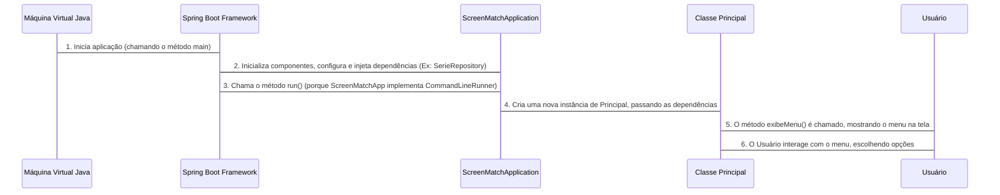

# Chapter 3: Ponto de Entrada da Aplicação


Bem-vindo ao terceiro capítulo do nosso guia `ScreenMatch`! Nos capítulos anteriores, estabelecemos bases importantes: no [Capítulo 1: Categorias de Séries](01_categorias_de_séries_.md), aprendemos a padronizar e traduzir os gêneros das séries usando o `enum Categoria`. Em seguida, no [Capítulo 2: Modelos de Dados Principais](02_modelos_de_dados_principais_.md), vimos como as classes `Serie` e `Episodio` nos ajudam a organizar todas as informações sobre nossas séries e seus capítulos.

Agora, temos os "tijolos" e a "planta" do nosso aplicativo. Mas como damos vida a tudo isso? Como o nosso `ScreenMatch` realmente "liga" e começa a funcionar, exibindo um menu para o usuário e permitindo que ele interaja?

Imagine que você está construindo uma casa. Você tem todos os cômodos prontos (seus modelos de dados) e sabe a função de cada um. Mas para que a casa seja útil, você precisa de uma porta principal, certo? Um lugar por onde as pessoas possam entrar, onde a luz seja acesa e as coisas comecem a acontecer.

No mundo da programação, esse "ponto de entrada" é o coração do programa, o lugar onde tudo começa. É por aqui que o sistema "liga" e inicia todas as suas funções, como exibir o menu principal e preparar o terreno para que as séries e episódios possam ser buscados e gerenciados. Ele orquestra a inicialização de outros componentes essenciais do aplicativo.

Neste capítulo, vamos explorar exatamente isso: a "porta principal" do `ScreenMatch`, a parte do código que é executada primeiro e que coloca toda a engrenagem em movimento.

---

## O Coração da Aplicação: `main` e `CommandLineRunner`

Em qualquer aplicação Java, o ponto de entrada principal é sempre um método chamado `main`. É a partir dele que o programa começa sua execução. No entanto, como estamos usando o Spring Boot (um framework que facilita a criação de aplicações robustas), a inicialização é um pouco mais gerenciada.

Vamos dar uma olhada no arquivo `ScreenMatchApplication.java`:

```java
// src/main/java/br/com/alura/ScreenMatch/ScreenMatchApplication.java
package br.com.alura.ScreenMatch;

import org.springframework.boot.CommandLineRunner; // Importa a interface
import org.springframework.boot.SpringApplication;
import org.springframework.boot.autoconfigure.SpringBootApplication;
import org.springframework.beans.factory.annotation.Autowired; // Para injeção de dependências
import br.com.alura.ScreenMatch.repository.SerieRepository;
import br.com.alura.ScreenMatch.programa.Principal; // Importa nossa classe Principal

@SpringBootApplication
public class ScreenMatchApplication implements CommandLineRunner {
	@Autowired
	SerieRepository serieRepository; // Veremos em capítulos futuros!

	public static void main(String[] args) {
		// Este é o método principal que inicia o Spring Boot
		SpringApplication.run(ScreenMatchApplication.class, args);
	}

	@Override
	public void run(String... args) throws Exception {
		// Este método é executado DEPOIS que o Spring Boot é inicializado
		Principal principal = new Principal(serieRepository); // Cria nosso "orquestrador"
		principal.exibeMenu(); // Inicia a interação com o usuário
	}
}
```

**O que estamos vendo aqui?**

1.  **`public static void main(String[] args)`**: Esta é a porta de entrada tradicional para qualquer programa Java. No caso de uma aplicação Spring Boot, o que ela faz é chamar `SpringApplication.run()`. Pense nisso como o botão "Ligar" que aciona todo o motor do Spring Boot.

2.  **`@SpringBootApplication`**: Esta anotação é mágica do Spring Boot. Ela combina várias outras anotações importantes para configurar rapidamente sua aplicação. Ela diz ao Spring Boot: "Esta é uma aplicação Spring Boot, por favor, configure tudo para mim!".

3.  **`implements CommandLineRunner`**: Esta é uma interface do Spring Boot. Quando uma classe implementa `CommandLineRunner`, o Spring Boot sabe que deve executar o método `run()` dessa classe *depois que toda a aplicação estiver configurada e pronta para uso*. É o lugar perfeito para colocar a lógica inicial do seu programa, como exibir um menu, carregar dados, etc.

4.  **`@Autowired SerieRepository serieRepository;`**: Não se preocupe muito com `SerieRepository` agora (vamos vê-lo em detalhes no [Capítulo 6: Repositório de Dados](06_repositório_de_dados_.md)). Por enquanto, saiba que `@Autowired` é uma forma do Spring Boot "entregar" automaticamente para a sua classe um objeto que ela precisa, sem que você precise criá-lo manualmente. É como um serviço de entrega que traz o que você pediu na porta.

---

## Dando Vida ao `ScreenMatch`: A Classe `Principal`

Dentro do método `run()` da nossa `ScreenMatchApplication`, você pode ver as linhas mais importantes para o ponto de entrada da nossa lógica de negócio:

```java
// ... dentro do método run()
// Instancia o objeto principal que orquestra a interação com o usuário
Principal principal = new Principal(serieRepository);
// Chama o método que exibe o menu e inicia a interação
principal.exibeMenu();
```

Aqui está a mágica acontecendo:

*   **`Principal principal = new Principal(serieRepository);`**: Criamos uma instância (um "objeto") da classe `Principal`. A classe `Principal` será o nosso "orquestrador" ou "gerente" da aplicação. É ela quem vai interagir com o usuário, buscar séries, exibir informações, etc. Passamos o `serieRepository` para ela, pois a classe `Principal` precisará dele para buscar e manipular os dados das séries.

*   **`principal.exibeMenu();`**: Depois de criar nosso orquestrador, chamamos o método `exibeMenu()` nele. É este método que efetivamente inicia a interação com o usuário, exibindo o menu de opções (como "Buscar série", "Listar séries salvas", etc.) no console.

Ou seja, a `ScreenMatchApplication` é como o "cérebro" que inicia o sistema, e a `Principal` é como o "rosto" do programa, que interage diretamente com você.

---

## O Fluxo de Inicialização (Por Dentro)

Vamos visualizar como tudo isso se encaixa desde o momento em que você "liga" a aplicação:



**Explicando o fluxo passo a passo:**

1.  **A Máquina Virtual Java (JVM) inicia:** Quando você executa a aplicação (por exemplo, clicando em "Run" no seu IDE ou digitando `java -jar screenmatch.jar`), a JVM é quem dá o pontapé inicial, chamando o método `main` na `ScreenMatchApplication`.
2.  **Spring Boot entra em ação:** O `SpringApplication.run()` inicia todo o processo de inicialização do Spring Boot. Ele escaneia seu projeto, configura as coisas, e prepara todos os componentes, incluindo a injeção de dependências como o `SerieRepository` para a nossa `ScreenMatchApplication`.
3.  **`CommandLineRunner` é ativado:** Assim que o Spring Boot termina de inicializar tudo e a aplicação está pronta, ele procura por qualquer classe que tenha implementado a interface `CommandLineRunner`. Ele encontra nossa `ScreenMatchApplication` e chama automaticamente o método `run()`.
4.  **O "Orquestrador" nasce:** Dentro do método `run()`, nós criamos uma nova instância da `Classe Principal`. É como se o maestro pegasse sua batuta e se preparasse para reger a orquestra.
5.  **O Menu é exibido:** Em seguida, chamamos o método `exibeMenu()` na instância da `Principal`. Isso faz com que as opções do nosso aplicativo (como "Buscar série", "Listar séries", etc.) apareçam no console para o usuário.
6.  **Interação com o Usuário:** A partir daí, o usuário pode digitar suas escolhas, e a `Classe Principal` cuidará de processá-las, buscando dados, exibindo resultados, etc.

---

## Conclusão

Neste capítulo, desvendamos o "Ponto de Entrada da Aplicação" no `ScreenMatch`. Aprendemos que:

*   O método `main` é o ponto de partida para a JVM, que por sua vez aciona o Spring Boot.
*   A interface `CommandLineRunner` é essencial no Spring Boot para executar nossa lógica inicial *depois* que o ambiente da aplicação está totalmente configurado.
*   A `ScreenMatchApplication` atua como o "iniciador", criando a instância da `Classe Principal`.
*   A `Classe Principal` é o nosso "orquestrador" que, ao ter seu método `exibeMenu()` chamado, inicia a interação direta com o usuário.

Entender o ponto de entrada é crucial porque ele é a primeira etapa na jornada do usuário com seu aplicativo. Com a aplicação agora ligada e o menu sendo exibido, o próximo passo é mergulhar profundamente na `Classe Principal` e entender como ela realmente interage com o usuário e coordena as outras partes do sistema.

Pronto para o próximo passo? Clique aqui: [Interface e Orquestrador Principal](04_interface_e_orquestrador_principal_.md)

---

Generated by [AI Codebase Knowledge Builder](https://github.com/The-Pocket/Tutorial-Codebase-Knowledge)