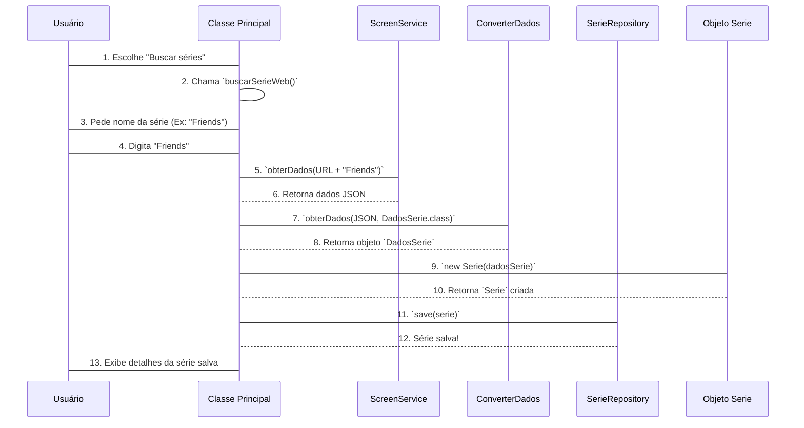

# Chapter 4: Interface e Orquestrador Principal


Bem-vindo ao quarto capítulo do nosso tutorial sobre o `ScreenMatch`! Nos capítulos anteriores, montamos a base do nosso aplicativo: no [Capítulo 1: Categorias de Séries](01_categorias_de_séries_.md), padronizamos os gêneros. No [Capítulo 2: Modelos de Dados Principais](02_modelos_de_dados_principais_.md), criamos os "formulários" (`Serie` e `Episodio`) para guardar as informações. E no [Capítulo 3: Ponto de Entrada da Aplicação](03_ponto_de_entrada_da_aplicação_.md), vimos como o programa "liga" e prepara o terreno para tudo começar.

Agora que o motor do `ScreenMatch` está aquecido, como o usuário realmente interage com ele? Como exibimos um menu, pedimos o nome de uma série ou mostramos os resultados da busca?

Pense no `ScreenMatch` como uma orquestra. Você tem os músicos (seus modelos de dados, serviços de busca, repositórios de dados), cada um pronto para fazer sua parte. Mas quem coordena tudo? Quem dá o sinal para a música começar, indica quando um instrumento deve tocar e quando a melodia deve mudar?

No nosso `ScreenMatch`, essa figura é a classe **`Principal`**. Ela é o nosso "maestro" ou "orquestrador principal". É a `Principal` que interage diretamente com você, o usuário, mostrando o menu de opções, pedindo informações e chamando as funções corretas para buscar séries online, listar as que já foram salvas, ou encontrar detalhes sobre episódios. Ela organiza o fluxo de trabalho principal e a experiência do usuário no console.

Neste capítulo, vamos mergulhar na classe `Principal` para entender como ela gerencia toda a interação e coordena as diferentes partes do nosso aplicativo.

---

## A Classe `Principal`: O Maestro da Aplicação

A classe `Principal` é onde a mágica da interação acontece. Ela contém o laço principal que mantém o programa rodando, exibindo opções e esperando a sua escolha.

Vamos dar uma olhada na estrutura básica da classe `Principal` e como ela exibe o menu:

```java
// src/main/java/br/com/alura/ScreenMatch/programa/Principal.java
package br.com.alura.ScreenMatch.programa;

import br.com.alura.ScreenMatch.repository.SerieRepository; // Para lidar com séries salvas
import br.com.alura.ScreenMatch.service.ScreenService;       // Para buscar dados da web
import br.com.alura.ScreenMatch.service.ConverterDados;      // Para converter JSON em objetos

import java.util.Scanner; // Para ler a entrada do usuário

public class Principal {
    // Declaração de objetos que a Principal vai usar
    private Scanner sc = new Scanner(System.in); // Objeto para ler o que o usuário digita
    private ScreenService screenService = new ScreenService(); // Nosso serviço de busca web
    private ConverterDados converterDados = new ConverterDados(); // Nosso conversor de dados
    private SerieRepository serieRepository; // Onde séries salvas são guardadas (veremos no Cap. 6)

    // Construtor: Spring Boot entrega o SerieRepository aqui
    public Principal(SerieRepository serieRepository) {
        this.serieRepository = serieRepository;
    }

    // Método principal que exibe o menu e gerencia as opções
    public void exibeMenu() {
        int opcao = -1; // Variável para a escolha do usuário

        while (opcao != 0) { // O programa continua rodando até o usuário digitar 0
            System.out.println("\nMENU: " +
                    "\n1: Buscar séries " +
                    "\n2: Buscar episódios " +
                    // ... outras opções
                    "\n0: Sair");

            opcao = sc.nextInt(); // Lê a opção que o usuário digitou
            sc.nextLine(); // Consome a quebra de linha pendente

            // Lógica para lidar com a opção escolhida
            if (opcao == 1) {
                buscarSerieWeb(); // Chama o método para buscar série na web
            } else if (opcao == 2) {
                buscarEpisodioPorSerie(); // Chama o método para buscar episódios
            }
            // ... outras condições para outras opções
            else if (opcao == 0) {
                System.out.println("Saindo do programa. Até mais!");
            } else {
                System.out.println("Opção inválida. Tente novamente.");
            }
        }
    }
    // ... outros métodos da classe
}
```

**O que vemos aqui?**

*   **`Scanner sc = new Scanner(System.in);`**: Este objeto `Scanner` é a nossa "orelha". Ele permite que o programa "ouça" o que o usuário digita no console.
*   **`ScreenService screenService = new ScreenService();` e `ConverterDados converterDados = new ConverterDados();`**: A classe `Principal` não faz tudo sozinha. Ela precisa de "ajudantes" ou "serviços" para realizar tarefas específicas, como buscar dados na internet (`ScreenService`) ou transformar esses dados em objetos Java (`ConverterDados`). Veremos esses detalhes no [Capítulo 5: Integração com API Externa (OMDB)](05_integração_com_api_externa__omdb__.md).
*   **`SerieRepository serieRepository;`**: Esta é a nossa conexão com o local onde as séries são salvas (um banco de dados, por exemplo). A `Principal` usa o `SerieRepository` para salvar novas séries ou buscar séries já existentes. Aprenderemos mais sobre isso no [Capítulo 6: Repositório de Dados](06_repositório_de_dados_.md). O `serieRepository` é "entregue" à `Principal` pelo Spring Boot quando ela é criada, graças à "injeção de dependências" que vimos no [Capítulo 3: Ponto de Entrada da Aplicação](03_ponto_de_entrada_da_aplicação_.md).
*   **`public void exibeMenu()`**: Este é o coração da interação. Ele entra em um loop `while` que continua enquanto o usuário não escolher a opção `0` (Sair). Dentro do loop, ele imprime as opções do menu e espera pela entrada do usuário.
*   **`if (opcao == 1) { buscarSerieWeb(); }`**: Baseado na escolha do usuário, a `Principal` chama o método apropriado para realizar a ação desejada. Por exemplo, se o usuário digita `1`, o método `buscarSerieWeb()` é chamado.

### Exemplo de Uso: Interagindo com o Menu

Quando você executa o `ScreenMatch`, a primeira coisa que verá é o menu:

```
MENU:
1: Buscar séries
2: Buscar episódios
3: Filtrar séries buscadas
4: Buscar série por título
5: Buscar séries por ator
6: Top 5 séries
7: Buscar série por gênero
0: Sair
```

Se você digitar `1` e pressionar Enter, o programa chamará o método `buscarSerieWeb()`. Se digitar `0`, ele sairá. A `Principal` está sempre esperando a sua próxima instrução!

---

## Como o Orquestrador `Principal` Funciona por Dentro

Vamos entender o fluxo de como a classe `Principal` coordena as ações quando você escolhe uma opção do menu. Vamos usar a opção "1: Buscar séries" como exemplo.

### O Fluxo da Busca de Série na Web

1.  **Usuário Escolhe**: Você digita `1` no menu.
2.  **`Principal` Captura**: O método `exibeMenu()` da `Principal` lê sua escolha.
3.  **`Principal` Delega (Chamada de `buscarSerieWeb`)**: Vendo que a escolha é `1`, a `Principal` chama seu próprio método `buscarSerieWeb()`.
4.  **`buscarSerieWeb` Interage com o Usuário**: Este método pede o nome da série ao usuário.
5.  **`buscarSerieWeb` Pede Dados à `ScreenService`**: Com o nome da série, `buscarSerieWeb()` pede à `ScreenService` para ir à API externa e buscar os dados.
6.  **`ScreenService` Busca e Retorna JSON**: A `ScreenService` (nosso "mensageiro" da internet) faz o trabalho sujo de se comunicar com a API e retorna os dados em formato JSON.
7.  **`buscarSerieWeb` Pede Conversão à `ConverterDados`**: O JSON bruto não é útil para nós. Então, `buscarSerieWeb()` pede à `ConverterDados` para transformar esse JSON em um objeto `DadosSerie` (que é um "registro" simplificado dos dados da série).
8.  **`buscarSerieWeb` Cria Objeto `Serie`**: Com os `DadosSerie` em mãos, `buscarSerieWeb()` cria um novo objeto da classe `Serie` (do [Capítulo 2: Modelos de Dados Principais](02_modelos_de_dados_principais_.md)). Lembre-se que o construtor da `Serie` já converte o gênero usando o `enum Categoria` do [Capítulo 1: Categorias de Séries](01_categorias_de_séries_.md).
9.  **`buscarSerieWeb` Salva a `Serie` no Repositório**: Finalmente, o objeto `Serie` recém-criado é passado para o `SerieRepository` para ser salvo permanentemente (por exemplo, em um banco de dados).



### Detalhes da Implementação (Exemplos de Métodos)

Vamos ver alguns trechos de código desses métodos dentro da classe `Principal` para entender como a orquestração acontece:

#### Método `buscarSerieWeb()`

Este método é o responsável por orquestrar a busca de uma série na web, a conversão dos dados e o salvamento.

```java
// src/main/java/br/com/alura/ScreenMatch/programa/Principal.java
// ... dentro da classe Principal

public void buscarSerieWeb() {
    DadosSerie dados = buscaSerie(); // Pede ao método 'buscaSerie' para fazer o trabalho pesado
    Serie serie = new Serie(dados); // Cria um objeto Serie a partir dos dados recebidos
    serieRepository.save(serie);    // Salva a nova série no banco de dados
    System.out.println(serie);      // Exibe os detalhes da série no console
}

// ...
```
**Explicação:** O método `buscarSerieWeb()` atua como um "gerente" que delega tarefas. Ele chama `buscaSerie()` (que veremos a seguir) para obter os dados, então cria um objeto `Serie` e o salva usando o `serieRepository`.

#### Método `buscaSerie()`

Este método é um auxiliar que realmente lida com a comunicação com a `ScreenService` e a `ConverterDados`.

```java
// src/main/java/br/com/alura/ScreenMatch/programa/Principal.java
// ... dentro da classe Principal

public DadosSerie buscaSerie() {
    System.out.println("Insira o nome de uma série: ");
    String nomeSerie = sc.nextLine(); // Lê o nome da série do usuário

    // Monta a URL e busca os dados da série na web
    var json = screenService.obterDados(ENDEREÇO + nomeSerie.replace(" ", "+") + APIKEY);
    // Converte o JSON recebido para um objeto DadosSerie
    DadosSerie dadosSerie = converterDados.obterDados(json, DadosSerie.class);

    return dadosSerie; // Retorna os dados da série
}
// ...
```
**Explicação:** Aqui vemos a `Principal` usando seus "ajudantes": `screenService` para buscar a informação na internet e `converterDados` para transformar o texto (`json`) em um objeto que podemos usar no Java (`DadosSerie`). O `ENDEREÇO` e `APIKEY` são constantes que formam a URL para a API externa (detalhes no [Capítulo 5: Integração com API Externa (OMDB)](05_integração_com_api_externa__omdb__.md)).

#### Método `listarSeriesBuscadas()`

Este é um exemplo de como a `Principal` exibe dados que já foram salvos:

```java
// src/main/java/br/com/alura/ScreenMatch/programa/Principal.java
// ... dentro da classe Principal

public void listarSeriesBuscadas(){
    // Obtém todas as séries que estão salvas no banco de dados
    series = serieRepository.findAll();
    // Ordena as séries por gênero e as imprime no console
    series.stream()
            .sorted(Comparator.comparing(Serie::getGenero))
            .forEach(System.out::println);
}
// ...
```
**Explicação:** Para listar séries, a `Principal` não precisa ir à internet. Ela simplesmente pede ao `serieRepository` (o "arquivo" de séries salvas) para buscar todas as séries. Depois de recebê-las, ela as organiza (neste caso, por gênero) e as imprime para o usuário.

---

## Conclusão

Neste capítulo, desvendamos o papel crucial da classe `Principal` no `ScreenMatch`. Vimos que ela é o "maestro" que:

*   **Exibe o menu** e gerencia a interação com o usuário através de um loop contínuo.
*   **Recebe as escolhas** do usuário e decide qual ação tomar.
*   **Coordena e delega tarefas** a outras classes (como `ScreenService`, `ConverterDados` e `SerieRepository`) para buscar, converter e salvar informações, sem fazer todo o trabalho pesado sozinha.
*   **Integra os conhecimentos** dos capítulos anteriores, usando a `Categoria` (do [Capítulo 1](01_categorias_de_séries_.md)) e os modelos `Serie` e `Episodio` (do [Capítulo 2](02_modelos_de_dados_principais_.md)).

A classe `Principal` é a central de comando que liga a interface do usuário com a lógica de negócio do nosso aplicativo. Com o nosso orquestrador pronto para comandar, o próximo passo é entender como ele realmente busca as informações das séries e episódios de uma fonte externa.

Pronto para o próximo passo? Clique aqui: [Integração com API Externa (OMDB)](05_integração_com_api_externa__omdb__.md)

---

Generated by [AI Codebase Knowledge Builder](https://github.com/The-Pocket/Tutorial-Codebase-Knowledge)