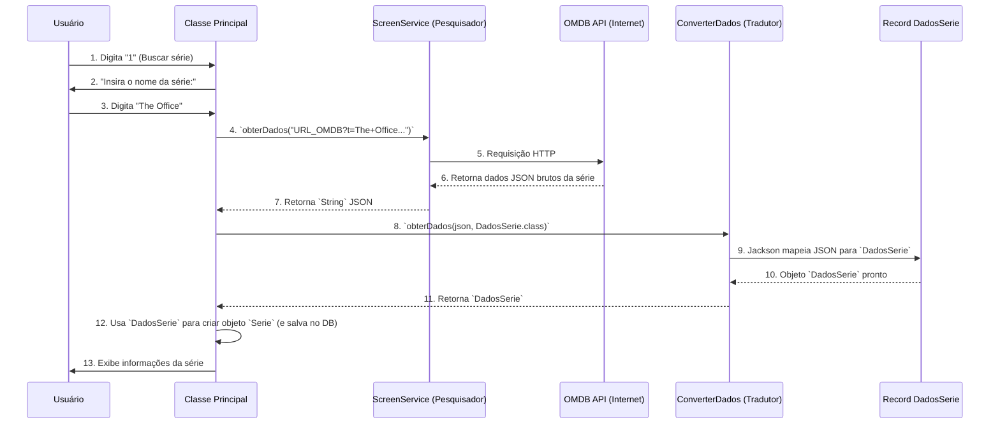

# Chapter 5: Integração com API Externa (OMDB)


Bem-vindo ao quinto capítulo do nosso tutorial sobre o `ScreenMatch`! Nos capítulos anteriores, montamos a base da nossa aplicação. No [Capítulo 1: Categorias de Séries](01_categorias_de_séries_.md), aprendemos a padronizar os gêneros. No [Capítulo 2: Modelos de Dados Principais](02_modelos_de_dados_principais_.md), criamos os "formulários" (`Serie` e `Episodio`) para guardar as informações. E nos [Capítulos 3: Ponto de Entrada da Aplicação](03_ponto_de_entrada_da_aplicação_.md) e [4: Interface e Orquestrador Principal](04_interface_e_orquestrador_principal_.md), vimos como a aplicação "liga" e como a classe `Principal` age como o "maestro", interagindo com o usuário e coordenando as ações.

Agora que nossa aplicação está "ligada" e pronta para receber comandos do usuário, como ela realmente consegue as informações sobre as séries e episódios? Afinal, os dados não nascem dentro do nosso programa; eles precisam vir de algum lugar!

Imagine que você tem uma biblioteca em casa, mas precisa de um livro que não está nela. Você precisa de alguém que vá até uma grande "biblioteca da internet" (como a Wikipedia ou um catálogo de filmes online), encontre o livro, e o traga para você. Além disso, se o livro estiver em um idioma que você não entende, você precisará de um tradutor para passá-lo para sua língua.

No `ScreenMatch`, a "biblioteca da internet" é a **API OMDB** (Open Movie Database), um serviço online que nos fornece informações sobre filmes e séries. Nosso desafio é:
1.  **Buscar**: Como o `ScreenMatch` "vai" até a OMDB API para pedir os dados de uma série?
2.  **Entender**: Quando a OMDB API responde, ela envia os dados em um formato especial chamado **JSON** (JavaScript Object Notation), que é um texto complexo. Como o `ScreenMatch` "traduz" esse JSON para objetos Java que podemos usar facilmente (`Serie`, `Episodio`)?

Este capítulo vai desvendar exatamente isso! Apresentaremos os componentes que agem como o "pesquisador" e o "tradutor" de informações de séries da internet: o `ScreenService` e o `ConverterDados`, com a ajuda dos "moldes" `DadosSerie`, `DadosTemporadas` e `DadosEpisodios`.

---

## `ScreenService`: O Pesquisador da Internet

O `ScreenService` é como o "braço" do nosso `ScreenMatch` que estende a mão para a internet. Sua única missão é ir até um endereço da web (a OMDB API, neste caso), pedir alguns dados e trazer a resposta em formato de texto. Ele não se preocupa em entender o que veio; apenas busca o pacote e o entrega.

Vamos ver como ele faz isso:

```java
// src/main/java/br/com/alura/ScreenMatch/service/ScreenService.java
package br.com.alura.ScreenMatch.service;

import java.io.IOException;
import java.net.URI;
import java.net.http.HttpClient;
import java.net.http.HttpRequest;
import java.net.http.HttpResponse;

public class ScreenService {

    public String obterDados(String endereco) {
        // 1. Cria um "cliente" para fazer requisições HTTP (como um navegador invisível)
        HttpClient client = HttpClient.newHttpClient();
        
        // 2. Monta a requisição: para qual endereço ir
        HttpRequest request = HttpRequest.newBuilder()
                .uri(URI.create(endereco)) // Converte o texto do endereço em um URI
                .build();
        
        // 3. Variável para guardar a resposta
        HttpResponse<String> response = null;
        try {
            // 4. Envia a requisição e espera pela resposta (o "pacote" da internet)
            response = client.send(request, HttpResponse.BodyHandlers.ofString());
        } catch (IOException | InterruptedException e) {
            // Se algo der errado (ex: sem internet), ele avisa
            throw new RuntimeException("Erro ao obter dados: " + e.getMessage());
        }

        // 5. Extrai o "corpo" da resposta, que é o texto JSON
        String json = response.body();
        return json; // Retorna o texto JSON bruto
    }
}
```

**Como funciona?**

1.  **`HttpClient`**: É como um navegador web em miniatura dentro do seu programa. Ele sabe como se conectar a servidores na internet.
2.  **`HttpRequest`**: É o "pedido" que enviamos para a internet. Diz qual `URI` (o endereço web, como `https://www.omdbapi.com/?t=The+Office&apikey=SUAKEY`) e qual tipo de pedido (neste caso, uma simples leitura).
3.  **`client.send(request, ...)`**: Este é o momento em que o `ScreenService` "vai" até a internet, envia o pedido e espera pela resposta.
4.  **`HttpResponse<String>`**: Quando a resposta chega, ela vem como um `HttpResponse`. O `<String>` indica que queremos o corpo da resposta como texto (que será nosso JSON).
5.  **`response.body()`**: Extrai o texto real da resposta. Este texto é o JSON bruto que a OMDB API nos enviou.

**Exemplo de uso (chamado pela `Principal`):**

A classe `Principal` (nosso maestro) diria algo como:

```java
// Supondo que ENDEREÇO e APIKEY são constantes para montar a URL da OMDB
String nomeSerie = "The Office";
String url = ENDEREÇO + nomeSerie.replace(" ", "+") + APIKEY;

// screenService vai até a internet e traz o JSON
String jsonRecebido = screenService.obterDados(url);

System.out.println("JSON bruto recebido da OMDB API: \n" + jsonRecebido.substring(0, 100) + "...");
// Saída esperada (apenas as primeiras 100 letras para não poluir):
// JSON bruto recebido da OMDB API:
// {"Title":"The Office","Year":"2005–2013","Rated":"TV-14","Released":"24 Mar 2005","Seasons":9,"Episode":"N/A","Genre":"Comedy, Drama",...
```
O `ScreenService` nos entrega uma `String` gigante contendo todos os dados, mas ainda é um texto difícil de trabalhar diretamente. Precisamos traduzi-lo!

---

## `ConverterDados`: O Tradutor de JSON

O `ConverterDados` é o nosso "tradutor". Ele pega o texto JSON bruto que o `ScreenService` trouxe e o transforma em objetos Java que o `ScreenMatch` pode entender e usar facilmente. Para fazer essa "mágica", ele usa uma biblioteca muito popular chamada **Jackson**.

Pense que o `ScreenService` lhe entregou um livro em chinês (JSON). O `ConverterDados` é a pessoa que lê o livro em chinês e o reescreve para você em português, em um "formulário" que você entende (nossos objetos `DadosSerie`, `DadosTemporadas`, etc.).

```java
// src/main/java/br/com/alura/ScreenMatch/service/ConverterDados.java
package br.com.alura.ScreenMatch.service;

import com.fasterxml.jackson.core.JsonProcessingException;
import com.fasterxml.jackson.databind.ObjectMapper; // A classe mágica do Jackson

public class ConverterDados implements IConverterDados{
    // Um "mapeador" de objetos JSON para objetos Java
    private ObjectMapper mapper = new ObjectMapper();

    @Override
    public <T> T obterDados(String json, Class<T> classe) {
        try {
            // Tenta ler o JSON e converter para a classe Java especificada
            return mapper.readValue(json, classe);
        } catch (JsonProcessingException e) {
            // Se o JSON estiver mal formatado ou não puder ser convertido, avisa
            throw new RuntimeException("Erro ao converter JSON: " + e.getMessage());
        }
    }
}
```

**Como funciona?**

1.  **`ObjectMapper mapper = new ObjectMapper();`**: Este é o "cérebro" do Jackson. Ele sabe como analisar textos JSON e como preencher objetos Java com os dados encontrados.
2.  **`mapper.readValue(json, classe)`**: Esta é a operação principal. Você dá a ele o `json` (o texto bruto) e diz a `classe` Java para a qual você quer que ele converta (ex: `DadosSerie.class`). O Jackson faz todo o trabalho pesado de ler o JSON e criar um objeto daquela classe, preenchendo seus campos.

---

## Os "Moldes" de Dados: `DadosSerie`, `DadosTemporadas`, `DadosEpisodios`

Antes que o `ConverterDados` possa traduzir o JSON, ele precisa saber para qual "formato" ele deve traduzir. Esses "formatos" são os nossos **Records** (um tipo especial de classe no Java 14+), como `DadosSerie`, `DadosTemporadas` e `DadosEpisodios`. Eles são como "moldes" ou "formulários" que definem exatamente quais informações esperamos receber do JSON e como elas devem ser chamadas em Java.

### Por que "Records"?

`Record` é um recurso do Java que simplifica a criação de classes que servem apenas para guardar dados. Eles automaticamente criam construtores, métodos `get` (para acessar os dados), `equals`, `hashCode` e `toString`. São perfeitos para representar dados que vêm de fora, como um JSON.

### As Anotações Mágicas (`@JsonAlias`, `@JsonIgnoreProperties`)

*   **`@JsonAlias("NomeNaAPI")`**: A OMDB API envia os nomes dos campos em inglês (ex: `"Title"`, `"imdbRating"`). Mas no nosso Java, queremos usar nomes mais amigáveis e em português (ex: `titulo`, `avaliacao`). O `@JsonAlias` faz essa "ponte": ele diz ao Jackson para mapear o campo `"Title"` do JSON para o nosso campo `titulo` em Java.
*   **`@JsonIgnoreProperties(ignoreUnknown = true)`**: Às vezes, a API envia mais informações do que precisamos ou conhecemos. Esta anotação diz ao Jackson para "ignorar" quaisquer campos no JSON que não estejam definidos no nosso "molde" (no nosso `record`). Assim, evitamos erros se a API mudar ou tiver campos extras.

Vamos ver os "moldes" que usamos:

#### `DadosSerie`: O Molde para Informações Gerais da Série

Este `record` define como o Jackson deve preencher um objeto `DadosSerie` quando ele encontra os dados de uma série principal no JSON.

```java
// src/main/java/br/com/alura/ScreenMatch/entities/DadosSerie.java
package br.com.alura.ScreenMatch.entities;

import com.fasterxml.jackson.annotation.JsonAlias;
import com.fasterxml.jackson.annotation.JsonIgnoreProperties;

@JsonIgnoreProperties(ignoreUnknown = true) // Ignora campos que não definimos
public record DadosSerie(@JsonAlias("Title") String titulo,       // Mapeia "Title" para 'titulo'
                         @JsonAlias("totalSeasons") Integer totalTemporadas, // Mapeia "totalSeasons" para 'totalTemporadas'
                         @JsonAlias("imdbRating") String avaliacao, // Mapeia "imdbRating" para 'avaliacao'
                         @JsonAlias("Genre") String genero,       // Mapeia "Genre" para 'genero'
                         @JsonAlias("Actors") String atores,      // Mapeia "Actors" para 'atores'
                         @JsonAlias("Poster") String poster,      // Mapeia "Poster" para 'poster'
                         @JsonAlias("Plot") String sinopse,       // Mapeia "Plot" para 'sinopse'
                         @JsonAlias("Released") String lancamento){ // Mapeia "Released" para 'lancamento'
}
```
**O que vemos aqui?** Cada campo do nosso `record` tem um `@JsonAlias` que diz ao Jackson qual o nome correspondente no JSON.

#### `DadosTemporadas`: O Molde para as Temporadas (que contêm episódios)

Este `record` é usado para pegar informações sobre uma temporada específica, incluindo uma lista de seus episódios.

```java
// src/main/java/br/com/alura/ScreenMatch/entities/DadosTemporadas.java
package br.com.alura.ScreenMatch.entities;

import com.fasterxml.jackson.annotation.JsonAlias;
import com.fasterxml.jackson.annotation.JsonIgnoreProperties;

import java.util.List;

@JsonIgnoreProperties(ignoreUnknown = true)
public record DadosTemporadas(@JsonAlias("Season") Integer numero, // Mapeia "Season" para 'numero'
                              // Mapeia "Episodes" para uma lista de DadosSerie (cada um é um episódio neste contexto)
                              @JsonAlias("Episodes") List<DadosSerie> dadosSerieList) {
}
```
**Observação:** O nome `dadosSerieList` no `DadosTemporadas` é um pouco confuso, mas neste contexto, cada `DadosSerie` dentro dessa lista representa os dados de um *episódio*. A API OMDB retorna os dados de episódios no mesmo formato dos dados de uma série em alguns campos, por isso reutilizamos o `DadosSerie` para esses itens na lista.

#### `DadosEpisodios`: O Molde para Detalhes de um Episódio (específico)

Este `record` é para os detalhes de um único episódio, quando buscamos a lista de episódios de uma temporada.

```java
// src/main/java/br/com/alura/ScreenMatch/entities/DadosEpisodios.java
package br.com.alura.ScreenMatch.entities;

import com.fasterxml.jackson.annotation.JsonAlias;
import com.fasterxml.jackson.annotation.JsonIgnoreProperties;

@JsonIgnoreProperties(ignoreUnknown = true)
public record DadosEpisodios(@JsonAlias("Title") String titulo,    // Mapeia "Title" para 'titulo'
                             @JsonAlias("Episode") Integer episodio, // Mapeia "Episode" para 'episodio'
                             @JsonAlias("imdbRating") String avaliacao, // Mapeia "imdbRating" para 'avaliacao'
                             @JsonAlias("Released") String lancamento) { // Mapeia "Released" para 'lancamento'
}
```

---

## Colocando Tudo Junto: O Fluxo da Integração com a API

Agora, vamos ver como a `Principal` (nosso maestro), o `ScreenService` (pesquisador) e o `ConverterDados` (tradutor) trabalham juntos para buscar e processar as informações de uma série.

Lembre-se do método `buscarSerieWeb()` da classe `Principal` que vimos no [Capítulo 4: Interface e Orquestrador Principal](04_interface_e_orquestrador_principal_.md). É nele que a mágica acontece:



**Explicando o fluxo passo a passo:**

1.  **Usuário Inicia**: O usuário escolhe a opção "Buscar séries" no menu da `Principal`.
2.  **`Principal` Pede Nome**: A `Principal` pede ao usuário o nome da série desejada.
3.  **`Principal` Monta URL e Chama `ScreenService`**: Com o nome da série (ex: "The Office"), a `Principal` monta o endereço completo para a OMDB API e pede ao `ScreenService` para `obterDados` desse endereço.
4.  **`ScreenService` Busca na OMDB API**: O `ScreenService` vai até a OMDB API e envia a requisição.
5.  **OMDB API Responde com JSON**: A OMDB API processa o pedido e retorna uma `String` gigante com os dados da série em formato JSON.
6.  **`ScreenService` Retorna JSON**: O `ScreenService` pega essa `String` JSON e a devolve para a `Principal`.
7.  **`Principal` Chama `ConverterDados`**: Agora com o JSON em mãos, a `Principal` pede ao `ConverterDados` para `obterDados` desse JSON, especificando que ela quer um objeto `DadosSerie` de volta.
8.  **`ConverterDados` Traduz com Jackson**: O `ConverterDados` usa o `ObjectMapper` do Jackson para ler o JSON. Ele consulta o molde `DadosSerie` para saber como mapear os campos do JSON para os campos do `record`.
9.  **`ConverterDados` Retorna Objeto `DadosSerie`**: O Jackson cria um novo objeto `DadosSerie` com as informações já traduzidas e estruturadas, e o `ConverterDados` o retorna para a `Principal`.
10. **`Principal` Processa e Exibe**: Finalmente, a `Principal` recebe o `DadosSerie` "limpo" e pronto para uso. Ela então pode usá-lo para criar um objeto `Serie` (que vimos no [Capítulo 2: Modelos de Dados Principais](02_modelos_de_dados_principais_.md)) e exibir as informações ao usuário ou salvá-las (o que veremos no próximo capítulo!).

### Exemplo de Código no `Principal` (Revisão)

Este é o método `buscaSerie()` da classe `Principal` que orquestra os chamados ao `ScreenService` e `ConverterDados`:

```java
// src/main/java/br/com/alura/ScreenMatch/programa/Principal.java
// ... dentro da classe Principal

public DadosSerie buscaSerie() {
    System.out.println("Insira o nome de uma série: ");
    String nomeSerie = sc.nextLine(); // Lê o nome da série do usuário (Ex: "The Office")

    // Monta a URL completa para a OMDB API.
    // ENDEREÇO e APIKEY são constantes. Replace " " por "+" para URLs.
    String urlDaApi = ENDEREÇO + nomeSerie.replace(" ", "+") + APIKEY;

    // 1. Chama o ScreenService para obter os dados brutos (JSON) da internet
    String jsonRecebido = screenService.obterDados(urlDaApi);

    // 2. Chama o ConverterDados para traduzir o JSON para um objeto DadosSerie
    DadosSerie dadosDaSerieTraduzidos = converterDados.obterDados(jsonRecebido, DadosSerie.class);

    return dadosDaSerieTraduzidos; // Retorna o objeto DadosSerie
}
```
Este método é o ponto central onde a `Principal` delega a busca ao `ScreenService` e a tradução ao `ConverterDados`, recebendo de volta os dados já estruturados como um `DadosSerie`.

---

## Conclusão

Neste capítulo, desvendamos como o `ScreenMatch` interage com o mundo exterior para obter informações sobre séries. Aprendemos que:

*   O **`ScreenService`** atua como o "pesquisador", que busca os dados brutos (JSON) da **OMDB API** na internet.
*   O **`ConverterDados`** age como o "tradutor", que usa a biblioteca Jackson para transformar o JSON bruto em objetos Java estruturados e fáceis de usar.
*   Os **`Records`** como `DadosSerie`, `DadosTemporadas` e `DadosEpisodios` são os "moldes" que definem a estrutura para a qual o JSON é traduzido, utilizando anotações como `@JsonAlias` e `@JsonIgnoreProperties` para fazer a mágica do mapeamento.
*   A classe `Principal` orquestra todo o processo, chamando o `ScreenService` e o `ConverterDados` em sequência para obter os dados das séries de forma organizada.

Com esses mecanismos, o `ScreenMatch` é capaz de "ler" informações da internet e entendê-las. Mas onde guardamos essas informações depois de traduzidas? No próximo capítulo, vamos mergulhar no **[Repositório de Dados](06_repositório_de_dados_.md)**, onde aprenderemos como salvar e gerenciar as séries e episódios de forma permanente.

Pronto para o próximo passo? Clique aqui: [Repositório de Dados](06_repositório_de_dados_.md)

---

Generated by [AI Codebase Knowledge Builder](https://github.com/The-Pocket/Tutorial-Codebase-Knowledge)