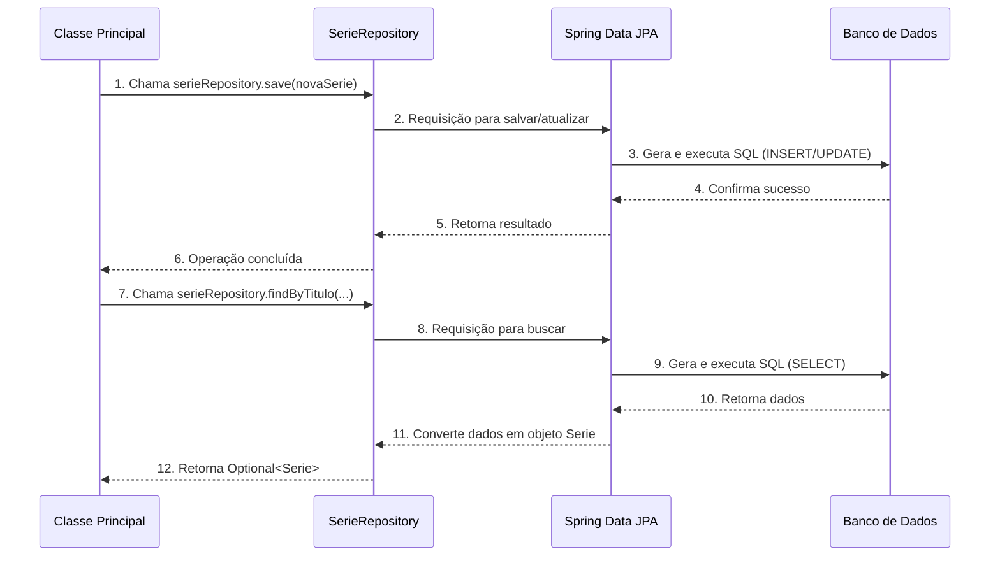

# Chapter 6: Repositório de Dados


Bem-vindo ao sexto capítulo do nosso tutorial sobre o `ScreenMatch`! Nos capítulos anteriores, construímos as bases da nossa aplicação: aprendemos a padronizar os gêneros com o [`enum Categoria`](01_categorias_de_séries_.md), criamos os [`Modelos de Dados Principais`](02_modelos_de_dados_principais_.md) (`Serie` e `Episodio`), vimos como o programa "liga" no [`Ponto de Entrada da Aplicação`](03_ponto_de_entrada_da_aplicação_.md) e como a [`Classe Principal` (o "maestro")](04_interface_e_orquestrador_principal_.md) interage com o usuário. Finalmente, no [`Capítulo 5: Integração com API Externa (OMDB)`](05_integração_com_api_externa__omdb__.md), descobrimos como buscar informações de séries e episódios da internet, traduzindo o JSON para nossos objetos Java.

Agora, temos o poder de ir à internet, buscar uma série como "The Office", e transformá-la em um objeto `Serie` que nosso programa entende. Mas e se você fechar o `ScreenMatch` e abri-lo novamente? Essa série "The Office" terá desaparecido! Ela só existiu na memória do computador enquanto o programa estava rodando.

Imagine que você é um bibliotecário e está sempre pegando livros novos de várias fontes. É ótimo ter o livro em mãos, mas para que sua biblioteca seja útil, você precisa de um sistema para:
*   **Guardar** os livros de forma permanente.
*   **Encontrar** um livro específico pelo título.
*   **Filtrar** livros de um certo gênero ou autor.
*   **Organizar** por popularidade ou avaliação.

No `ScreenMatch`, precisamos de um "arquivista" que faça exatamente isso: converse com o banco de dados para salvar, buscar e organizar nossas séries e episódios de forma permanente. Este "arquivista" é o conceito de **Repositório de Dados**, e no nosso projeto, ele é representado pela interface `SerieRepository`. Ele age como uma ponte segura e eficiente entre a sua aplicação e o armazenamento dos dados.

Neste capítulo, vamos entender como o `SerieRepository` nos permite armazenar e consultar nossas séries de forma persistente.

---

## O que é um Repositório de Dados?

No contexto do `ScreenMatch`, o `Repositório de Dados` (especificamente o `SerieRepository`) é uma interface especial que define as operações que podemos fazer com nossos objetos `Serie` no banco de dados. Pense nele como a **recepção de uma biblioteca**: você não precisa saber *como* os livros são guardados nas prateleiras ou *qual* a melhor forma de encontrá-los. Você simplesmente pede à recepção: "Por favor, guarde este livro" ou "Procure o livro 'A Culpa é das Estrelas'".

A grande sacada é que, com o Spring Boot e uma ferramenta chamada Spring Data JPA, você não precisa escrever o código complexo para salvar, buscar ou atualizar dados no banco. Você apenas define uma **interface** com alguns nomes de métodos específicos, e o Spring Data JPA automaticamente cria a lógica por trás desses métodos para você! É mágica pura!

---

## `SerieRepository`: Nossa Recepção de Dados

Vamos dar uma olhada na interface `SerieRepository.java`:

```java
// src/main/java/br/com/alura/ScreenMatch/repository/SerieRepository.java
package br.com.alura.ScreenMatch.repository;

import br.com.alura.ScreenMatch.entities.Categoria;
import br.com.alura.ScreenMatch.entities.Serie;
import org.springframework.data.jpa.repository.JpaRepository;

import java.util.List;
import java.util.Optional;

// A interface do nosso repositório de séries
public interface SerieRepository extends JpaRepository<Serie, Integer> {

    // Método para buscar série pelo título (ignorando maiúsculas/minúsculas)
    Optional<Serie> findByTituloContainingIgnoreCase(String nomeSerie);

    // Método para buscar séries por ator e avaliação mínima
    List<Serie> findByAtoresContainingIgnoreCaseAndAvaliacaoGreaterThanEqual(String nomeAtor, double avaliacao);

    // Método para buscar as top 5 séries mais bem avaliadas
    List<Serie> findTop5ByOrderByAvaliacaoDesc();

    // Método para buscar séries por gênero
    List<Serie> findByGenero(Categoria categoria);
}
```

**O que vemos aqui?**

1.  **`public interface SerieRepository extends JpaRepository<Serie, Integer>`**:
    *   `interface SerieRepository`: Declara que `SerieRepository` é uma interface. Interfaces no Java definem um "contrato" de métodos que outras classes devem implementar.
    *   `extends JpaRepository<Serie, Integer>`: Esta é a parte mais importante! `JpaRepository` é uma interface do Spring Data JPA que já vem com muitos métodos prontos para você, como `save()` (para salvar), `findAll()` (para listar todos), `findById()` (para buscar por ID), e muitos outros.
    *   `<Serie, Integer>`: Os dois parâmetros indicam:
        *   `Serie`: O tipo de dado (entidade) que este repositório vai gerenciar. No nosso caso, objetos `Serie` (do [`Capítulo 2: Modelos de Dados Principais`](02_modelos_de_dados_principais_.md)).
        *   `Integer`: O tipo do identificador único (ID) da nossa classe `Serie` (o `id` da série é um `Long`, mas para este exemplo simplificado, considere `Integer` ou `Long` como o tipo correto para o ID da sua entidade).

2.  **Métodos com Nomes Mágicos**:
    *   `Optional<Serie> findByTituloContainingIgnoreCase(String nomeSerie);`
    *   `List<Serie> findByAtoresContainingIgnoreCaseAndAvaliacaoGreaterThanEqual(String nomeAtor, double avaliacao);`
    *   `List<Serie> findTop5ByOrderByAvaliacaoDesc();`
    *   `List<Serie> findByGenero(Categoria categoria);`

    Esses métodos são a grande sacada do Spring Data JPA! Você não precisa escrever nenhum código SQL (linguagem de banco de dados) para eles. O Spring Data JPA é inteligente o suficiente para **entender o que você quer fazer apenas pelo nome do método**!

    *   `findBy...`: Significa "encontre por...".
    *   `TituloContainingIgnoreCase`: Encontre séries onde o `titulo` (campo da nossa classe `Serie`) contém o texto que você passar, ignorando maiúsculas e minúsculas.
    *   `AtoresContainingIgnoreCaseAndAvaliacaoGreaterThanEqual`: Encontre séries onde os `atores` contêm o nome e a `avaliacao` é maior ou igual ao valor informado.
    *   `findTop5ByOrderByAvaliacaoDesc`: Encontre as 5 melhores (Top 5), ordenando pela `avaliacao` em ordem descendente (do maior para o menor).
    *   `findByGenero(Categoria categoria)`: Encontre séries pelo `genero` (nosso [`enum Categoria`](01_categorias_de_séries_.md)).

É assim que o Spring Data JPA transforma o nome de um método em uma consulta ao banco de dados!

---

## Usando o `SerieRepository` na `Classe Principal`

Agora que entendemos o que é o `SerieRepository` e seus métodos, vamos ver como a nossa [`Classe Principal` (o "maestro")](04_interface_e_orquestrador_principal_.md) o utiliza para realizar as operações que o usuário pede.

Lembre-se que o `SerieRepository` é "entregue" à `Principal` pelo Spring Boot.

### 1. Salvando uma Série

Quando o usuário busca uma série na web e a `Principal` a traduz para um objeto `Serie`, o próximo passo é salvá-la permanentemente.

```java
// Trecho simplificado de Principal.java -> método buscarSerieWeb()
// ...
public void buscarSerieWeb() {
    // 1. Busca os dados da série na internet e os converte para um objeto Serie
    DadosSerie dados = buscaSerie();
    Serie serie = new Serie(dados);

    // 2. SALVA a série no banco de dados usando o repositório
    serieRepository.save(serie); // Método 'save' é fornecido por JpaRepository

    System.out.println("Série salva com sucesso!");
    System.out.println(serie); // Exibe os detalhes da série
}
// ...
```
**O que acontece:** Depois que a `Principal` cria um objeto `Serie` a partir dos dados da internet, ela simplesmente chama `serieRepository.save(serie)`. O Spring Data JPA cuida de todos os detalhes para inserir essa série no banco de dados.

### 2. Listando Todas as Séries Salvas

Para mostrar ao usuário quais séries já foram salvas, a `Principal` pede ao repositório para listar todas elas.

```java
// Trecho simplificado de Principal.java -> método listarSeriesBuscadas()
// ...
public void listarSeriesBuscadas(){
    // Obtém TODAS as séries que estão salvas no banco de dados
    List<Serie> seriesSalvas = serieRepository.findAll(); // Método 'findAll' é fornecido por JpaRepository

    System.out.println("\n--- Séries Salvas ---");
    seriesSalvas.stream()
            // Podemos ordená-las ou filtrá-las antes de exibir
            .sorted(Comparator.comparing(Serie::getTitulo))
            .forEach(System.out::println);
}
// ...
```
**O que acontece:** O método `findAll()` (que vem do `JpaRepository`) traz uma lista com *todas* as séries que estão gravadas no nosso banco de dados.

### 3. Buscando Séries por Título

Se o usuário quiser encontrar uma série específica que já foi salva:

```java
// Trecho simplificado de Principal.java -> método buscarSeriePorTitulo()
// ...
public void buscarSeriePorTitulo() {
    System.out.println("Digite o título da série que deseja buscar:");
    String tituloBusca = sc.nextLine();

    // Usa o método customizado do repositório
    Optional<Serie> serieEncontrada = serieRepository.findByTituloContainingIgnoreCase(tituloBusca);

    if (serieEncontrada.isPresent()) {
        System.out.println("Série encontrada: " + serieEncontrada.get());
    } else {
        System.out.println("Série não encontrada com o título: " + tituloBusca);
    }
}
// ...
```
**O que acontece:** `findByTituloContainingIgnoreCase()` faz a busca "inteligente" no banco. O `Optional` é um tipo de retorno que indica que a série *pode* ou *não pode* ser encontrada, evitando erros.

### 4. Outras Buscas Avançadas

A `Principal` pode usar outros métodos definidos no `SerieRepository` para buscas mais complexas:

```java
// Exemplo: Buscar Top 5 séries mais bem avaliadas
// ... em algum método da classe Principal
public void buscarTop5Series() {
    List<Serie> topSeries = serieRepository.findTop5ByOrderByAvaliacaoDesc();
    System.out.println("\n--- Top 5 Séries Mais Bem Avaliadas ---");
    topSeries.forEach(System.out::println);
}

// Exemplo: Buscar séries por gênero
// ... em algum método da classe Principal
public void buscarSeriesPorGenero() {
    System.out.println("Digite o gênero da série (Comédia, Drama, Ação, Crime, Romance):");
    String generoDigitado = sc.nextLine();
    try {
        // Converte o texto para nosso enum Categoria (Capítulo 1!)
        Categoria categoria = Categoria.fromPortugues(generoDigitado);
        List<Serie> seriesPorGenero = serieRepository.findByGenero(categoria);
        System.out.println("\n--- Séries do gênero " + generoDigitado + " ---");
        seriesPorGenero.forEach(System.out::println);
    } catch (IllegalArgumentException e) {
        System.out.println("Gênero inválido: " + generoDigitado);
    }
}
```

---

## O Fluxo da Persistência de Dados (Por Dentro)

Vamos visualizar como o `SerieRepository` atua como a ponte entre sua aplicação e o banco de dados.



**Explicando o fluxo passo a passo:**

1.  **`Principal` Inicia a Ação**: A `Classe Principal` (o maestro da aplicação) precisa salvar ou buscar uma série. Ela não faz isso diretamente, mas pede ao `SerieRepository`.
2.  **`SerieRepository` Delega ao Spring Data JPA**: Como o `SerieRepository` é uma interface do Spring Data JPA, a chamada é passada para o "motor" do Spring Data JPA. Ele é como o "cérebro" que sabe como transformar seu pedido em comandos de banco de dados.
3.  **Spring Data JPA e SQL**: O Spring Data JPA, de forma invisível para você, gera as instruções SQL (Structured Query Language) corretas para o banco de dados. Por exemplo, para `save(serie)`, ele gera um `INSERT` ou `UPDATE`. Para `findByTitulo...`, ele gera um `SELECT` com a cláusula `WHERE`.
4.  **Comunicação com o Banco de Dados**: Essas instruções SQL são enviadas para o sistema de gerenciamento de banco de dados (por exemplo, PostgreSQL, H2).
5.  **Banco de Dados Responde**: O banco de dados executa a instrução e retorna o resultado (sucesso na gravação, ou os dados encontrados).
6.  **Spring Data JPA Processa Resultados**: O Spring Data JPA recebe os resultados do banco. Se for uma busca, ele pega os dados brutos e os converte de volta para objetos `Serie` que seu programa entende.
7.  **`SerieRepository` Retorna para `Principal`**: Finalmente, o `SerieRepository` retorna o objeto `Serie` (ou lista de `Serie`s, ou `Optional<Serie>`) para a `Classe Principal`.

Tudo isso acontece de forma transparente! Você não precisa escrever uma única linha de SQL, apenas definir as interfaces e usar os métodos. Isso acelera muito o desenvolvimento e torna o código mais limpo e fácil de manter.

---

## Conclusão

Neste capítulo, mergulhamos no conceito de **Repositório de Dados** no `ScreenMatch`, focando no `SerieRepository`. Aprendemos que ele é:

*   O "arquivista" da nossa aplicação, responsável por interagir com o banco de dados.
*   Uma interface que estende `JpaRepository`, aproveitando o poder do Spring Data JPA para operações básicas (salvar, listar).
*   Capaz de realizar buscas complexas e específicas apenas pelo nome dos métodos (ex: `findByTituloContainingIgnoreCase`, `findTop5ByOrderByAvaliacaoDesc`).
*   A ponte que permite ao `ScreenMatch` salvar e recuperar informações de séries e episódios de forma permanente, mesmo depois que o programa é fechado.

Com o `SerieRepository`, o `ScreenMatch` não é mais uma aplicação que perde seus dados ao ser desligada. Agora, ela pode construir uma verdadeira biblioteca de séries!

Este é o último capítulo da nossa jornada pelo `ScreenMatch`. Esperamos que você tenha desvendado os principais conceitos de como uma aplicação robusta e interativa é construída, desde a categorização de dados até a persistência em um banco.

Parabéns por chegar até aqui!

---

Generated by [AI Codebase Knowledge Builder](https://github.com/The-Pocket/Tutorial-Codebase-Knowledge)