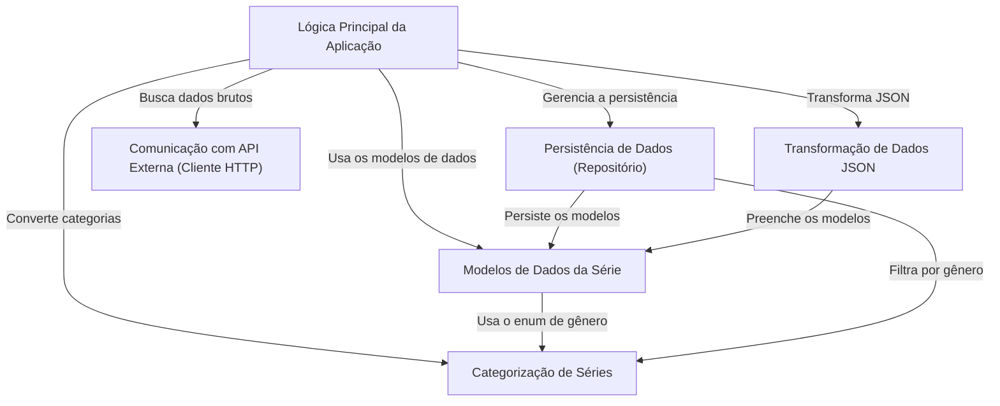

# Tutorial: ScreenMatch

O projeto `ScreenMatch` é uma aplicação de desktop projetada para ajudar usuários a *descobrir* e *gerenciar* informações sobre séries de TV. Ela permite que você **busque por séries** utilizando uma API externa (como a OMDB), **armazene seus detalhes** (incluindo episódios) em um banco de dados para referência futura, e *navegue* por sua coleção salva por diversos critérios como gênero ou ator.

**Repositório do Código-Fonte:** [https://github.com/IuryRibeiro1/ScreenMatch](https://github.com/IuryRibeiro1/ScreenMatch)

## Capítulos

1.  [Categorias de Séries](https://www.google.com/search?q=01_categorias_de_s%C3%A9ries_.md)
2.  [Modelos de Dados Principais](https://www.google.com/search?q=02_modelos_de_dados_principais_.md)
3.  [Ponto de Entrada da Aplicação](https://www.google.com/search?q=03_ponto_de_entrada_da_aplica%C3%A7%C3%A3o_.md)
4.  [Interface e Orquestrador Principal](https://www.google.com/search?q=04_interface_e_orquestrador_principal_.md)
5.  [Integração com API Externa (OMDB)](https://www.google.com/search?q=05_integra%C3%A7%C3%A3o_com_api_externa__omdb__.md)
6.  [Repositório de Dados](https://www.google.com/search?q=06_reposit%C3%B3rio_de_dados_.md)

-----

Gerado por [AI Codebase Knowledge Builder](https://github.com/The-Pocket/Tutorial-Codebase-Knowledge)